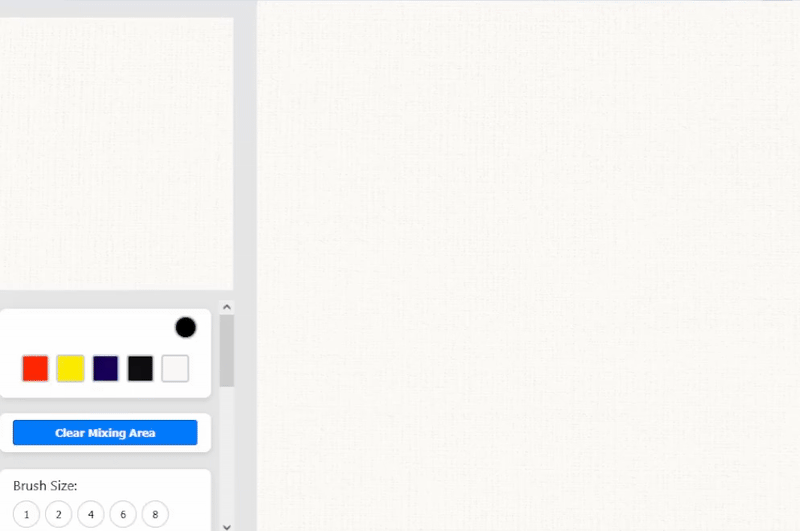
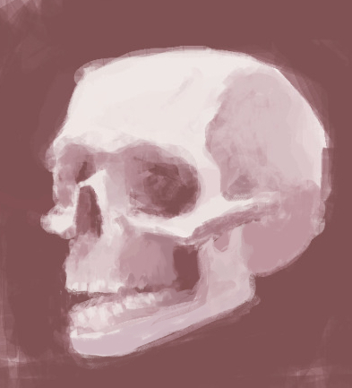
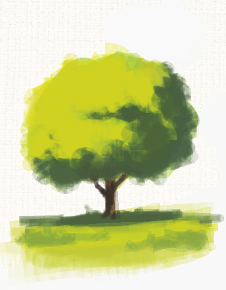
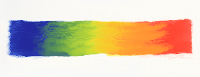

# Pigment Perfect Paint

<div align="center">

**An application that makes digital art feel a little more like traditional :)**



</div>

---

## Features

- Mix beautiful colors using pigment-based algorithm
- Create realistic textured strokes in real time
- Draw using your mouse or stylus pen
- Download your artworks


## Installation

1. **Clone the repository**
   ```bash
   git clone https://github.com/gustavo-melo-dev/pigment-perfect-paint.git
   cd pigment-perfect-paint
   ```

2. **Install dependencies**
   ```bash
   npm install
   ```

3. **Start the development server**
   ```bash
   npm run dev
   ```

4. **Open your browser**
   
   Navigate to `http://localhost:3000`

### Building for Production

```bash
npm run build
```

The built files will be in the `dist/` directory.

## How to Use

1. **Select a color** from the palette by clicking on a color swatch
2. **Choose a brush size** from the brush size buttons
3. **Adjust brush configs** using the sliders to control flow and amount of paint the brush picks up and returns to the canvas
4. **Paint in the mixing area** (upper left) to blend colors
5. **Select mixed colors** by clicking with (Alt + Left Click) or (Right Click)
6. **Paint in the canvas** using (Left Click)
7. **Download your artwork** using the "Download Image" button

## Acknowledgments

- [**Mixbox**](https://github.com/scrtwpns/mixbox) by Secret Weapons for providing the realistic color mixing algorithm

## Examples

<div align="center">


#### skull 



#### tree



#### gradient



</div>